# Mermaid Iconify

Community plugin for Obsidian that helps you use external Iconify packs inside Mermaid `architecture-beta` diagrams.

## What it does

- lists Iconify packs from the official catalog
- lets the user enable or disable packs for Mermaid
- registers enabled packs with Mermaid using `registerIconPacks()`
- opens an icon picker per pack
- shows live preview images for icons
- copies `prefix:name` syntax and Mermaid snippets ready to paste

## Why this plugin exists

Obsidian does not register external Mermaid icon packs by default. Mermaid supports custom icon packs, but they need to be registered first. This plugin focuses on making that workflow practical inside Obsidian.

## Installation for development

1. Clone this repository.
2. Run `npm install`.
3. Run `npm run build`.
4. Copy `manifest.json`, `main.js`, and `styles.css` to:
   - `<vault>/.obsidian/plugins/mermaid-iconify/`
5. Enable the plugin in **Community plugins**.

## Manual installation from a release

Copy these files from the GitHub release into:

`<vault>/.obsidian/plugins/mermaid-iconify/`

Files required:

- `manifest.json`
- `main.js`
- `styles.css`

## Usage

1. Open **Settings → Community plugins → Mermaid Iconify**.
2. Refresh the catalog if needed.
3. Enable the packs you want, for example `mdi`, `lucide`, or `logos`.
4. Open the picker for a pack.
5. Copy a value such as `mdi:laptop`.
6. Use it in Mermaid:

```mermaid
architecture-beta
    service app(mdi:laptop)[Admin]
    service store(mdi:store)[Store]
```



## Disclosures

### Network use

This plugin makes outbound HTTPS requests only when needed:

- `https://api.iconify.design/collections` to fetch the Iconify pack catalog
- `https://api.iconify.design/collection?prefix=...` to fetch icon names for a selected pack
- `https://unpkg.com/@iconify-json/<prefix>/icons.json` to load the actual Iconify JSON pack used by Mermaid
- `https://api.iconify.design/<prefix>/<icon>.svg?...` for preview images shown in the picker

The plugin does **not** send note contents or vault contents to those services.

### Accounts and payments

- no account required
- no payments
- no ads

### Telemetry and analytics

- no telemetry
- no analytics
- no tracking

### External file access

The plugin only stores its own settings inside Obsidian plugin data. It does not read arbitrary external files.

## Compatibility notes

- `isDesktopOnly` is set to `false`
- HTTP requests use Obsidian `requestUrl` rather than `fetch` for plugin network calls
- icon previews are loaded as remote SVG images in the picker UI

## Release checklist

- update `manifest.json` version
- create a GitHub release with a matching tag
- upload `main.js`, `manifest.json`, and `styles.css` to the release
- submit the plugin to `obsidianmd/obsidian-releases`

## Git cleanup

If `main.js`, `node_modules`, or `release-assets` were accidentally committed, run:

```powershell
powershell -ExecutionPolicy Bypass -File .\cleanup-git-tracked-files.ps1
```

## License

MIT
